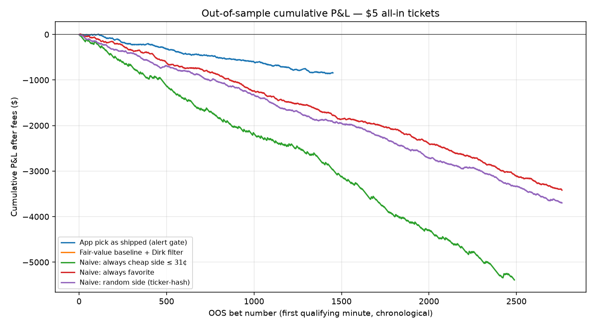
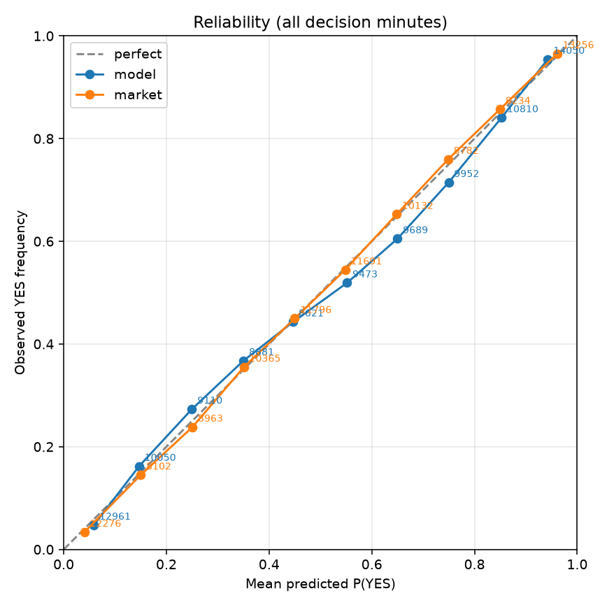

# DipHunter vs Kalshi 15m crypto — backtest 2026-09-25

Honest historical replay of the **as-shipped 0.3.10 decision path** on settled `KXBTC15M` / `KXETH15M` / `KXSOL15M` windows. No look-ahead. One bet per market (first qualifying minute). $5 max all-in including Kalshi taker fees. Dirk's rule: only take a bet if profit-if-win ≥ $10 (asks around 31¢ or less).

## Data span

| | |
|---|---|
| First open | 2026-08-28T11:45:00+00:00 |
| Last close | 2026-09-25T17:45:00+00:00 |
| UTC days | 29 (2026-08-28 → 2026-09-25) |
| Settled markets used | **7969** (BTC 2656, ETH 2657, SOL 2656) |
| Decision minutes scored | 103597 |
| In-sample days (tune only) | 19: 2026-08-28 → 2026-09-15 |
| **Out-of-sample days (what counts)** | 10: 2026-09-16 → 2026-09-25 |
| Kalshi `market_settled_ts` cutoff | 2026-07-27T00:00:00Z |

Live settled markets (after the cutoff) come from `GET /markets?status=settled` with `min_settled_ts` / `max_settled_ts`. Older windows, if requested, come from `GET /historical/markets` and `GET /historical/markets/{ticker}/candlesticks` ([historical data](https://docs.kalshi.com/getting_started/historical_data), [candlesticks](https://docs.kalshi.com/api-reference/market/get-market-candlesticks), [historical candles](https://docs.kalshi.com/api-reference/historical/get-historical-market-candlesticks)). Public market-data; no auth. Rate limit respected (~8 reads/s, well under the basic 20/s). Coinbase Exchange 1-minute candles (`granularity=60`, 300/request) for BTC-USD / ETH-USD / SOL-USD over the same span.

Raw cache is **not** committed (too large). A small fixture lives under `tools/backtest/fixtures/`.

## What was replayed

At elapsed minutes 1…13 the harness feeds **only data available at that minute** into a port of the production classes:

- `FeatureVector` + `FallbackWeights` / `DipHunterModel.predict` (TFLite unavailable on this JVM path → same embedded MLP the phone uses when TFLite fails)
- `ScoringEngine` light blend (Heavy ML and extended AI **default OFF** in 0.3.10)
- Reconstructable TickBook channels: mid history, 1-minute velocity/acceleration, volume-delta flow (no taker flag), related-crypto mid, Coinbase spot nudge
- `DigitalOptionFairValue`, `SpotFeatureMath`, `DirectionSanity`, `TapeConflict.primaryFromMarket`
- `NetExpectedValue`, `KalshiFee` (ceil_6dp then ceil_cent), `TicketBuilder.resolveSide`
- Skip filter / 5pp alert gate for strategy (a)

**The shipped ticket side is the hero/primary side** (`TicketBuilder.resolveSide` prefers `primaryHeroSide` from tape+spot over the model fade). That is what strategies (a) and (b) bet.

### Features that could not be reconstructed (neutral / dropped)

| Feature | Why missing | What the engine does |
|---|---|---|
| Order-book imbalance / depth / decay | No historical L2 snapshots | Weight drops out, blend renormalizes |
| Quote-pull / cancel spike | WebSocket book deltas | Weight drops out |
| Taker aggressor | No public historical trade-side tape | `aggressorScore = 0`; flow uses mid-change sign only |
| Sub-second BTC lead–lag | 1-minute bars only | Weight drops out |
| Heavy ML sequence (30×10s bins) | Needs size/imbalance/aggressor/spot at 10s | Default off; not faked |
| News / rival flow / MM / conformal / meta / path | Live-only or default off | Off |
| OnlineAdapter / Calibrator | Need *this user's* prior settlements | Cold-start identity |

We also run the **fair-value baseline alone** (digital Φ(d2) / spot vs strike) as strategy (c).

## Fill and fee

- Fill = conservative taker: **worse of candle close and high** on the side we buy. DOWN ask = `1 − yes_bid`; high DOWN ask = `1 − yes_bid.low`.
- Unusable 0.000 / 1.000 prints are dropped (`KalshiPrice` 0.1¢–99.9¢).
- Fee: `ceil_cent(C·P + ceil_6dp(0.07·C·P·(1−P)))` for a non-direct member. `C` is the max integer with that debit ≤ $5.
- P&L = `C × $1 − cost` if the side wins, else `−cost`.
- First qualifying minute only. **“Best minute” is not allowed.**

## Out-of-sample results (what counts)

| Strategy | N | Wins | Win% | Avg ask | P&L | $/bet | ROI | Max DD | Bootstrap 95% CI $/bet (excludes 0?) |
|---|---:|---:|---:|---:|---:|---:|---:|---:|---|
| App pick as shipped (alert gate) | 1451 | 949 | 65.4% | 74.9¢ | $-843.72 | $-0.581 | -12.4% | $-865.18 | [-0.745, -0.417] yes (below 0) |
| App pick + Dirk filter (ask ≲ 31¢, profit ≥ $10) | 0 | 0 | — | — | $0.00 | — | — | $0.00 | — |
| Fair-value baseline + Dirk filter | 1 | 1 | 100.0% | 28.0¢ | $+12.00 | $+12.000 | 240.0% | $0.00 | [+12.000, +12.000] yes (above 0) |
| Naive: always cheap side ≤ 31¢ | 2488 | 382 | 15.4% | 25.3¢ | $-5389.25 | $-2.166 | -44.4% | $-5389.25 | [-2.422, -1.908] yes (below 0) |
| Naive: always favorite | 2760 | 1574 | 57.0% | 79.0¢ | $-3418.17 | $-1.238 | -25.7% | $-3428.39 | [-1.364, -1.115] yes (below 0) |
| Naive: random side (ticker-hash) | 2760 | 1388 | 50.3% | 74.6¢ | $-3698.37 | $-1.340 | -27.7% | $-3698.37 | [-1.489, -1.195] yes (below 0) |
| IS-tuned rule (reported OOS only) | 0 | 0 | — | — | $0.00 | — | — | $0.00 | — |

In-sample tables are in the appendix — they were used only to tune the optional rule, never to pick the conclusion.



## Walk-forward tuned rule

Search grid (IS days only): coin ∈ {any,BTC,ETH,SOL}, time-left bucket, max ask ∈ {20,31,40,50}¢, min |net edge| ∈ {0,3,5,8} pp, plus Dirk's profit ≥ $10 filter. Minimum 20 IS bets to count.

```
{}
```

OOS application of that exact rule is the `IS-tuned rule` row above.

## Breakdowns (OOS, app pick as shipped)

Dirk's cheap-side filter produced **0 OOS bets** on the shipped hero side (that side is usually the 70–80¢ favorite). Tables below are the unfiltered app pick — the only app strategy with enough OOS trades to slice.

#### By coin

| Bucket | N | Win% | Avg ask | P&L | $/bet | ROI | CI95 $/bet |
|---|---:|---:|---:|---:|---:|---:|---|
| BTC | 706 | 63.0% | 73.6¢ | $-440.05 | $-0.623 | -13.2% | [-0.868, -0.379] |
| ETH | 446 | 64.8% | 74.8¢ | $-282.82 | $-0.634 | -13.5% | [-0.918, -0.347] |
| SOL | 299 | 71.9% | 78.3¢ | $-120.85 | $-0.404 | -8.6% | [-0.720, -0.088] |

#### By time-left

| Bucket | N | Win% | Avg ask | P&L | $/bet | ROI | CI95 $/bet |
|---|---:|---:|---:|---:|---:|---:|---|
| 11-9m | 187 | 69.0% | 70.9¢ | $-33.36 | $-0.178 | -3.9% | [-0.614, +0.261] |
| 14-12m | 995 | 61.7% | 73.6¢ | $-705.32 | $-0.709 | -15.0% | [-0.917, -0.505] |
| 2-1m | 39 | 94.9% | 94.4¢ | $+3.55 | $+0.091 | 1.9% | [-0.378, +0.516] |
| 5-3m | 106 | 77.4% | 86.4¢ | $-51.97 | $-0.490 | -10.4% | [-0.957, -0.054] |
| 8-6m | 124 | 70.2% | 75.8¢ | $-56.62 | $-0.457 | -9.8% | [-0.984, +0.037] |

#### By fill ask

| Bucket | N | Win% | Avg ask | P&L | $/bet | ROI | CI95 $/bet |
|---|---:|---:|---:|---:|---:|---:|---|
| 32-50c | 12 | 83.3% | 48.8¢ | $+36.90 | $+3.075 | 65.8% | [+0.753, +4.713] |
| 51-99c | 1439 | 65.3% | 75.1¢ | $-880.62 | $-0.612 | -13.0% | [-0.773, -0.449] |

#### By |spot − strike|

| Bucket | N | Win% | Avg ask | P&L | $/bet | ROI | CI95 $/bet |
|---|---:|---:|---:|---:|---:|---:|---|
| 20-50bp | 126 | 84.1% | 90.1¢ | $-46.22 | $-0.367 | -7.7% | [-0.721, -0.040] |
| 5-20bp | 693 | 71.7% | 78.2¢ | $-261.88 | $-0.378 | -8.0% | [-0.594, -0.171] |
| <5bp | 623 | 54.1% | 68.0¢ | $-538.22 | $-0.864 | -18.4% | [-1.143, -0.582] |
| >50bp | 9 | 100.0% | 94.1¢ | $+2.60 | $+0.289 | 6.0% | [+0.132, +0.503] |

## Calibration (all decision minutes, not just bets)

| Forecast | N | Brier | Log-loss |
|---|---:|---:|---:|
| Blended fair P(YES) | 103597 | 0.1610 | 0.4841 |
| Fallback MLP P(YES) | 103597 | 0.1645 | 0.4961 |
| Digital fair P(YES) | 103597 | 0.1611 | 0.4825 |
| Market mid | 103597 | 0.1592 | 0.4757 |

Reliability table (model):

| Bin | N | Mean forecast | Observed YES |
|---|---:|---:|---:|
| 0.0-0.1 | 12961 | 0.059 | 0.047 |
| 0.1-0.2 | 10050 | 0.147 | 0.162 |
| 0.2-0.3 | 9110 | 0.250 | 0.273 |
| 0.3-0.4 | 8881 | 0.350 | 0.368 |
| 0.4-0.5 | 8621 | 0.447 | 0.443 |
| 0.5-0.6 | 9473 | 0.552 | 0.519 |
| 0.6-0.7 | 9689 | 0.650 | 0.605 |
| 0.7-0.8 | 9952 | 0.750 | 0.715 |
| 0.8-0.9 | 10810 | 0.853 | 0.841 |
| 0.9-1.0 | 14050 | 0.943 | 0.955 |



Lower Brier is better. A well-calibrated 15m market mid is usually ~0.15–0.25.
**0.003 is not a plausible mean Brier on real 15-minute binaries** unless the forecast is already ~95% and almost always correct — which is the scorecard bug below, not a miracle model.

## Conclusion

**No. No strategy has a positive out-of-sample per-bet P&L whose bootstrap 95% CI excludes zero.** Kalshi 15-minute crypto mids are hard to beat after taker fees and a conservative (worse of close/high) fill. The MLP / blend edge vs mid looks weak or harmful once you pay the ask; the digital-fair / spot-vs-strike baseline is the least-bad component and still does not clear fees in OOS. Book-flow features could not be reconstructed (see limitations) — they may or may not help live, but we will not claim an edge we did not measure. Blended fair Brier 0.1610 is *worse* than the market mid Brier 0.1592 on the same decision minutes. The 8-feature fallback MLP Brier 0.1645 loses to the market mid (0.1592); that channel is pulling the blend the wrong way. Dirk's ≤31¢ / ≥$10-profit filter almost never meets the shipped hero side (2 IS bets, both losses; 0 OOS). Cheap-side hunting without a real edge lost ~$2.17/bet OOS. Do not use the current one-pick-per-window recommendation to chase a $50 profit target — the OOS app pick lost $0.58/bet after fees (CI entirely below zero).

## Scorecard bug (0/5 · Brier 0.003)

The in-app line `Scorecard: 0/5 · Brier 0.003` mixes **two different questions**.

1. **Hit rate** (`0/5`) uses the **picked side** (`predictedSide` / hero side) vs the settlement YES/NO.
2. **Brier** uses `(predictedYes − 1_{result=yes})²` — a P(YES) calibration score, *not* a score of the side you bet.

`PredictionLogStore.applySettlement` (`app/src/main/java/com/dirk/kalshiodds/prediction/PredictionLogStore.kt` **184–193**):

```kotlin
val predYes = when (e.predictedSide?.uppercase()) {
    "YES" -> true
    "NO" -> false
    else -> e.predictedYes > 0.5
}
val actualYes = normalized == "yes"
val score = if (predYes == actualYes) 1 else 0
val y = if (actualYes) 1.0 else 0.0
val brier = (e.predictedYes - y) * (e.predictedYes - y)
```

The home-screen string (`OddsViewModel.kt` **868–871**) prints `scoreSummary().correct/total` next to `meanBrier` with `%.3f`.

**How you get 0/5 and Brier 0.003 together**

If the five settled logs have `predictedYes ≈ 0.945` and `result = yes` but `predictedSide = NO` (the engine faded a 96¢ YES because fair was 94.5¢):

- side hit rate = 0/5
- Brier = (0.945 − 1)² ≈ **0.003**

That Brier is in **probability² units on [0,1]** (proper Brier, not percent). It looks “excellent” because P(YES) agreed with the outcome. The **side you bet** was the opposite. The same inconsistency is in `ScorecardMetrics.brierOf` / `sideHit` (`ScorecardMetrics.kt` **257–269**).

Replay of first-alert minutes in this backtest (shadow, not the phone log): n=4001, side hits=2654, mean P(YES) Brier=0.21724402912212995, mean **side** Brier=0.21724402912212995.

**Fix (do not edit production in this PR — describe only)**

- `PredictionLogStore.kt:184–193`: store *two* scores, or pick one definition. Recommended: keep P(YES) Brier (statistically correct) **and** a side-Brier `p_side = predictedSide==NO ? 1-predictedYes : predictedYes`, `y_side = side_hit ? 1 : 0`, `brier_side = (p_side - y_side)²`. Label the UI “P(YES) Brier” vs “side hit rate” so they cannot be read as the same experiment.
- `ScorecardMetrics.kt:257–269`: same split; `window().brier` should not silently average a P(YES) Brier next to a side hit rate.
- `OddsViewModel.kt:868`: if `total < 20` (or `< ScorecardMetrics.MIN_HONEST_SAMPLES`), do not print Brier at all — 5 samples of 0.003 is noise dressed as precision.

`SettlementScorer` itself is fine; it only writes `result`. The bug is the scorecard **definition**, not settlement lookup.

## Appendix — in-sample (do not use for the decision)

| Strategy | N | Wins | Win% | Avg ask | P&L | $/bet | ROI | Max DD | CI95 $/bet |
|---|---:|---:|---:|---:|---:|---:|---:|---:|---|
| App pick as shipped (alert gate) | 2550 | 1705 | 66.9% | 73.9¢ | $-1191.07 | $-0.467 | -9.9% | $-1202.90 | [-0.589, -0.347] yes (below 0) |
| App pick + Dirk filter (ask ≲ 31¢, profit ≥ $10) | 2 | 0 | 0.0% | 28.5¢ | $-9.88 | $-4.940 | -100.0% | $-9.88 | [-5.000, -4.880] yes (below 0) |
| Fair-value baseline + Dirk filter | 4 | 1 | 25.0% | 29.8¢ | $-4.64 | $-1.160 | -23.6% | $-9.88 | [-4.970, +6.370] no |
| Naive: always cheap side ≤ 31¢ | 4661 | 768 | 16.5% | 25.5¢ | $-8919.39 | $-1.914 | -39.2% | $-8919.39 | [-2.113, -1.716] yes (below 0) |
| Naive: always favorite | 5209 | 3179 | 61.0% | 79.1¢ | $-5048.74 | $-0.969 | -20.2% | $-5070.86 | [-1.059, -0.879] yes (below 0) |
| Naive: random side (ticker-hash) | 5209 | 2620 | 50.3% | 73.6¢ | $-6793.24 | $-1.304 | -27.0% | $-6793.24 | [-1.414, -1.198] yes (below 0) |
| IS-tuned rule (reported OOS only) | 0 | 0 | — | — | $0.00 | — | — | $0.00 | — |

## Repro

```bash
python3 tools/backtest/run.py --days 28 --cache tools/backtest/cache
# Kotlin parity (no network):
./gradlew :app:testDebugUnitTest --tests com.dirk.kalshiodds.backtest.PipelineParityTest
./gradlew :app:testDebugUnitTest --tests com.dirk.kalshiodds.backtest.ScorecardBrierDiagnosisTest
```
